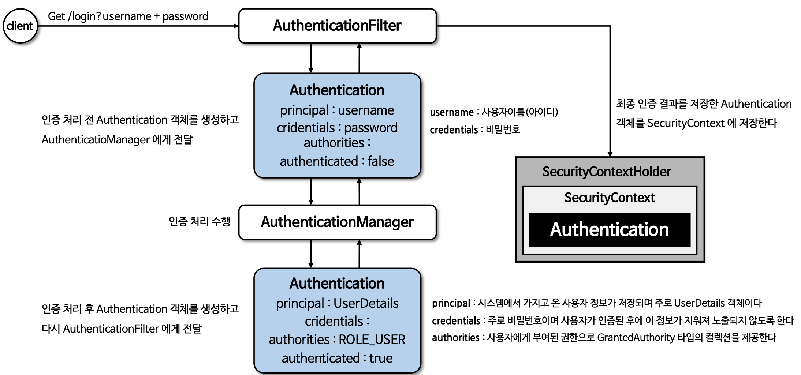

# 인증 아키텍처
- 시큐리티 인증 / 인가 흐름도

## Authentication

- 인증은 특정 자원에 접근 하려는 신원을 확인하는 방법을 의미한다.
- 사용자 이름과 비밀번호를 입력하게 하는 것으로 인증이 수행되면 신원을 알고 권한 부여를 할 수 있따.
- 사용자의 인증 정보를 저장하는 토큰 개념의 객체로 활용되며 인증 이후 SecurityContext 에 저장되어 전역정으로 참조 가능

### 구조 
Principal <-- Authentication
- getPrincipal() : 인증 주체를 의미하며 인증 요청의 경우 사용자 이름을, 인증 후에는 UserDetails 타임의 객체가 될 수 있다.
- getCredentials() : 인증 주체가 올바른 것을 증명하는 자격 증명 (비밀번호 등등..)
- getAuthorities() : 인증 주체(principal) 에게 부여된 권한을 나타낸다.
- getDetails() : 인증 요청에 대한 추가적인 세부 사항을 저장, IP / 인증서 일련번호 ...
- isAuthenticated() : 인증 상태 반환
- setAuthenticated(boolean) : 인증 상태 저장

### 인증 절차 흐름
