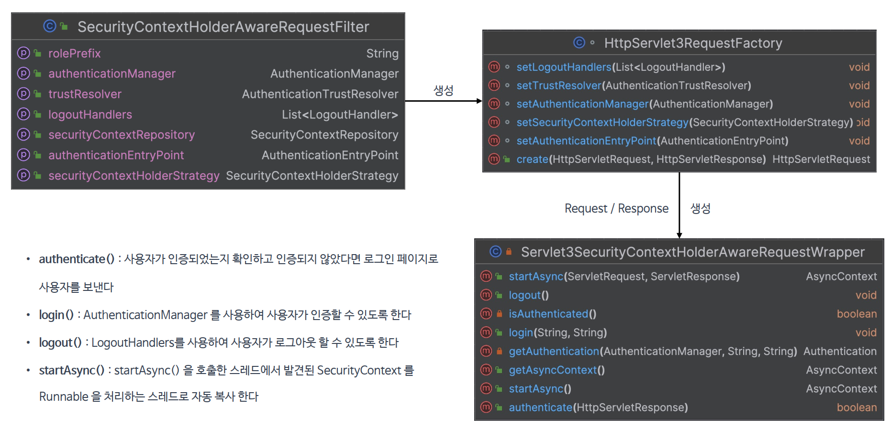

# 통합 하기

## 개요
- 스프링 시큐리티는 다양한 프레임워크 및 API 와의 통합을 제공하고 있으며 Servlet 3 과 Spring MVC 와 통합을 통해 여러 편리한 기능들을 사용할 수 있다
- 인증 관련 기능들을 필터가 아닌 서블릿 영역에서 처리할 수 있다

## Servlet 3+ 통합
1. SecurityContextHolderAwareRequestFilter
   - HTTP 요청이 처리될 때 HttpServletRequest 에 보안 관련 메소드를 추가적으로 제공하는 래퍼(SecurityContextHolderAwareRequestWrapper)    
   클래스를 적용한다
   - 이를 통해 개발자는 서블릿 API 의 보안 메소드를 사용하여 인증, 로그인, 로그아웃 등의 작업을 수행할 수 있다
2. HttpServlet3RequestFactory
   - Servlet 3 API 와의 통합을 제공하기 위한 Servlet3SecurityContextHolderAwareRequestWrapper 객체를 생성한다
3. Servlet3SecurityContextHolderAwareRequestWrapper
   - HttpServletRequest 의 래퍼 클래스로서 Servlet 3.0의 기능을 지원하면서 동시에 SecurityContextHolder 와의 통합을 제공한다
   - 이 래퍼를 사용함으로써 SecurityContext 에 쉽게 접근할 수 있고 Servlet 3.0 의    
   비동기 처리와 같은 기능을 사용하는 동안 보안 컨텍스트를 올바르게 관리할 수 있다

## 구조 및 API

## 코드 구현
- [IndexController.java_login](./src/main/java/com/spring/security/IndexController.java)   
- [IndexController.java_users](./src/main/java/com/spring/security/IndexController.java)
