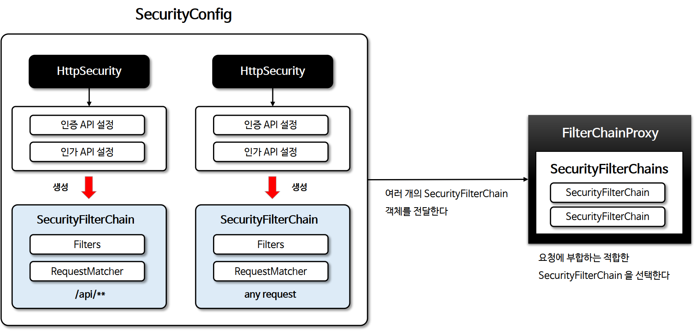
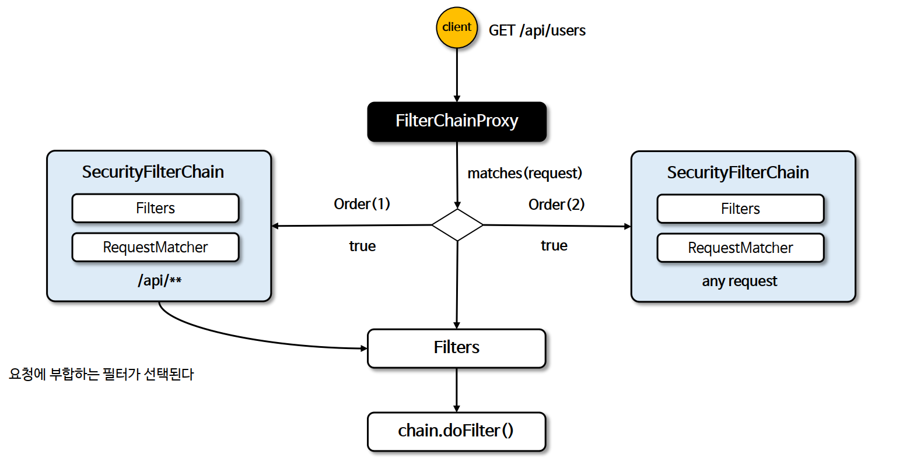

# 고급 설정

## 다중 보안 설정
- Spring security 는 여러 SecurityFilterChain @Bean 을 등록해서 다중 보안 기능을 구성할 수 있다.
- @Order 어노테이션을 사용해서 순서를 지정할 수 있다.

## 다중 보안 설정 초기화 구성

## 다중 보안 설정 요청 흐름도
- HttpSecurity 는 인스턴스별로 보안 기능이 작동 한다.
- 요청에 따라 RequestMatcher 를 사용해서 다른 보안 설정을 적용할 수 있다.   

