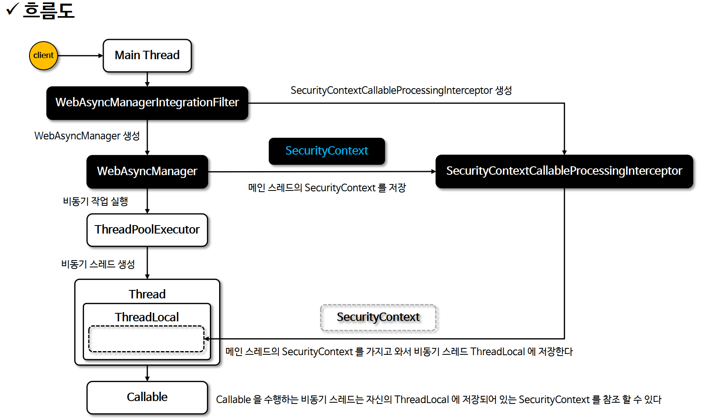

# 통합 하기

## 개요
- Spring Security 는 Spring MVC Controller 에서 Callable 을 실행하는 비동기 스레드에 SecurityContext 를 자동으로 설정하도록 지원한다
- Spring Security 는 WebAsyncManager 와 통합하여 SecurityContextHolder 에서 사용 가능한 SecurityContext 를 Callable 에서   
접근 가능하도록 해 준다

## WebAsyncManagerIntegrationFilter
- SecurityContext 와 WebAsyncManager 사이의 통합을 제공하며 WebAsyncManager 를 생성하고 SecurityContextCallableProcessingInterceptor   
를 WebAsyncManager 에 추가한다

## WebAsyncManager
- 스레드 풀의 비동기 스레드를 생성하고 Callable 을 받아 실행 시키는 주체로서 등록된 SecurityContextCallableProcessingInterceptor 를 통해   
현재 스래드가 보유하고 있는 SecurityContext 객체를 비동시 스레드의 ThreadLocal 에 저장한다.

## 코드 구현
- [AsyncService.java](./src/main/java/com/spring/security/AsyncService.java)
- [IndexController.java](./src/main/java/com/spring/security/IndexController.java)
- 비동시 스레드가 수행하는 Callable 영역 내에서 자산의 ThreadLocal 에 저장된 SecurityContext 를 참조 가능하며 이는   
부모 스레드가 가지고 있는 SecurityContext 와 동일하다
- @Async 나 다른 비동기 기술은 스프링 시큐리이놔 통합되어 있지 않기 때문에 비동기 스레드에 SecurityContext 가 적용되지 않는다.

## 흐름도
