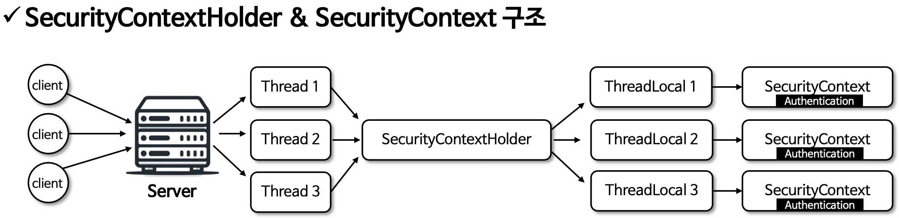

# 인증 아키텍쳐

## SecurityContext
- Authentication 저장
- ThreadLocal 저장소 사용 - SecurityContextHolder 를 통해 접근, ThreadLocal 저장소를 사용해 각 스레드가 자신만의 보안 컨텍스트를 유지
- 애플리케이션 전반에 걸친 접근성 - 현재 사용자의 인증 상태나 권함을 확인하는데 사용

## SecurityContextHolder
- SecurityContext 저장
- 전략패턴 사용
- 기본전략 : MODE_THREDLOCAL
- 전략모드 직접 지정 : SecurityContextHolder.setStrategyName(String)
- 저장 모드
  - MODE_THREDLOCAL : 기본모드, 각 스레드가 독립적인 보안 컨텍스트를 가진다. 대부분의 서버 환경에 적합
  - MODE_INHERITABLETHREADLOCAL : 부모 스레드로부터 자식 스레드로 보안 컨텍스트가 상속, 작업을 스레드 간 분산 실행할 경우 사용
  - MODE_GLOBAL : 전역적으로 단일 보안 컨텍스트를 사용하며 서버 환경에서는 부적합, 주로 간단한 애플리케이션에서 사용

## SecurityContext 참조 및 삭제
- 참조 : SecurityContextHolder.getContextHolderStrategy.getContext()
- 삭제 : SecurityContextHolder.getContextHolderStrategy.clearContext()

## SecurityContextHolder & SecurityContext 구조

- 스레드 마다 할당되는 전용 저장소에 SecurityContext 를 저장하기 때문에 동시성의 문제가 없다.
- 스레드 풀에서 운용되는 스레드일 경우 새로운 요청이더라도 기존의 ThreadLocal 이 재사용될 수 있기 때문에 클라이언트로    
응답 직전에 항상 SecurityContext 를 삭제 해 죽고 있다.