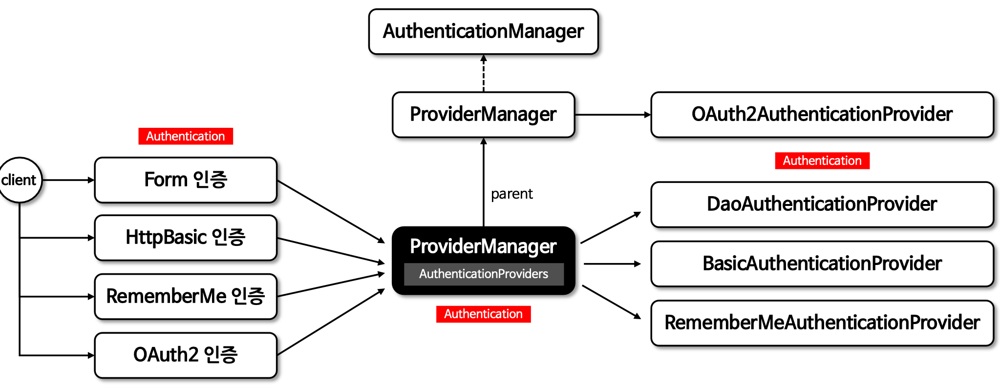

# 인증 아키텍쳐

## AuthenticationManger
해당 클래스를 기점으로   
(SecurityContextHolder, AuthenticationFilter, Authentication) -> 인증 받기 전   
(AuthenticationProvider, UserDetailsService, UserDetails) -> 인증 받은 후

- 인증필터로 부터 Authentication 객체를 전달받아 인증을 시도하며 인증에 성공할 경우 사용자 정보, 권한등을 반환 한다.
- 여러 AuthenticationProvider 들을 관리하며 AuthenticationProvider 목록을 순차적으로 순회하며 인증 요청 처리 한다.
- AuthenticationManagerBuilder 에 의해 객체가 생성되며 주로 사용하는 구현채로 ProviderManager 가 제공된다.

## AuthenticationManagerBuilder
- AuthenticationManager 객체를 생성하며 UserDetailsService 및 AuthenticationProvider 를 추가할 수 있다. 
- HttpSecurity.getSharedObject(AuthenticationManagerBuilder.class) 를 통해 객체를 참조할 수 있다.

## AuthenticationManager 흐름도

- 선택적으로 부모 AuthenticationManager 를 구성할 수 있으며 부모는 AuthenticationProvider 가 인증을 수행할 수 없는경우 추가 탐색 한다.
- 일반적으로 Provider 로 부터 null 이 아닌 응답을 받을때 까지 차례대로 시도 하다 응답 받지 못하면 ProviderNotFoundException 발생한다.

## AuthenticationProvider
- 사용자의 자격 증명을 확인하고 인증 과정을 관리하는 클래스로서 사용자가 시스템에 액세스 하기위해 제공한정보가 유요한지 검증하는 과정을 포함한다.
- 사용자의 이름과 비밀번호를 기반으로한 인증, 토큰 기반 인증 ,지문인식 등을 처리할 수 있다.
- 성공적인 인증 후에는 Authentication 객체를 반환하며 이 객체에는 사용자의 신원 정보와 인증된 자격 증명을 포함한다.
- AuthenticationException 과 같은 예외를 발싱시켜 문제를 알리는 역활을 한다