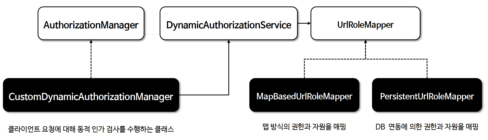
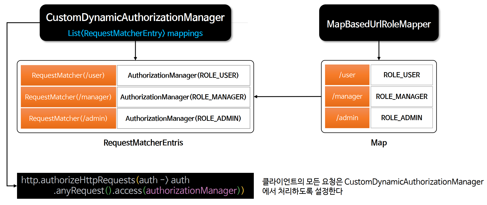
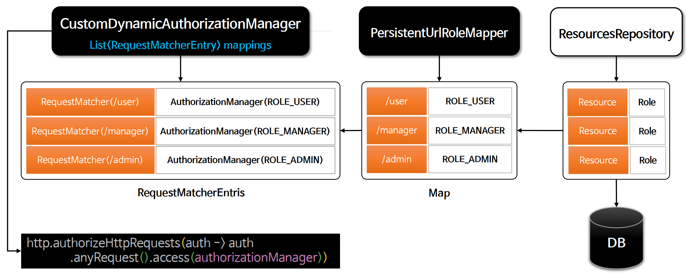

# 회원 관리 시스템

- 회원, 권한, 자원 관리 기능을 스프링 시큐리티와 연동하여 구현하는 방법을 학습한다
- 설정 클래스에서 권한 규칙 코드 모두 제거하고 프로그래밍에 의한 동적 권한으로 전환한다
- 회원 관리 시스템 구현

```java 
http
.authorizeHttpRequests(auth -> auth
.requestMatchers("/css/**", "/images/**", "/js/**", "/favicon.*", "/*/icon-*").permitAll()
.requestMatchers("/user").hasAuthority("ROLE_USER")
.requestMatchers("/admin/**").hasAuthority("ROLE_ADMIN")
.anyRequest().permitAll())
```
```java
http.authorizeHttpRequests(auth -> auth
.anyRequest().access(authorizationManager))
```
### 회원 관리 시스템 구현
- 회원 관리: 회원 리스트, 회원 상세정보, 권한 부여
- 권한 관리: 권한 리스트, 권한 생성, 수정, 삭제
- 자원 관리: 자원 리스트, 자원 생성, 삭제, 수정, 권한 매핑

## 프로그래밍 방식에 의한 인가 설정 - MAP (메모리 기반)
- 프로그래밍 방식에 의한 인가 기능을 위해 CustomDynamicAuthorizationManager 클래스를 만든다.    
이때 스프링 시큐리티의 인가 클래스인 RequestMatcherDelegatingAuthorizationManager 클래스의 인가 원리를 이해하고 참고한다
-  맵 방식으로 권한과 자원을 매핑하기 위해 UrlRoleMapper 인터페이스를 구현한 MapBasedUrlRoleMapper 클래스를 만든다




## DB 방식 인가 설정
- DB 방식 인가 설정을 위해 JPA를 사용하여 권한과 자원을 매핑하는 테이블을 만든다
- UrlRoleMapper 인터페이스를 구현한 PersistentUrlRoleMapper(DbBasedUrlRoleMapper) 클래스를 만든다



## 인가 설정 실시간 반영
- 인가 설정을 실시간으로 반영하기 위해 인가 설정을 DB에 저장하고, 설정이 변경되면 캐시를 갱신하는 방법을 학습한다
- ResourcesServiceImpl 에서 자원을 추가하거나 삭제할 때 인가 규칙이 즉시 적용 되도륵   
CustomDynamicAuthorizationManager 클래스의 캐시를 갱신한다
- CustomDynamicAuthorizationManager 클래스의 캐시를 갱신하기 위헤 mappings 를 clear 어 한후 reload 한다.