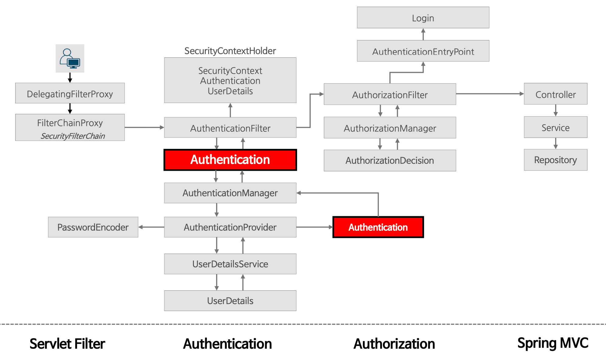

# 인증 프로세스

## 익명 사용자 - anonymous()

- 스프링 시큐리티에서 "익명으로 인증된" 사용자와 인증되지 않은 사용자간에 실제 개념 차이는 없지만 액세스 제어 속성을 구성하는 더 편리한 방법을 제공 한다.
- SecurityContextHolder 가 항상 Authenticaiton 객체를 포함하고 null 을 포함하지 않는다는 것을 규칙을 세우게 되면 클레스를 더 견고하게 작성할 수 있다.
- 익명 사용자와 익명 인증 사용자를 구분해서 어떤 기능을 수행하고자 할 때 유용할 수 있으며 익명 인증 객체를 세션에 저장하지 않는다.
- 익명 인증 사용자의 권한을 별도로 운용할 수 있다. 즉 인증된 사용자가 접근할 수 없도록 구성이 가능하다.

SecurityContextHolder 에 Authentication 객체가 없을 경우 감지하고 필요한 경우 새로운 Authentication 객체로 채운다.

