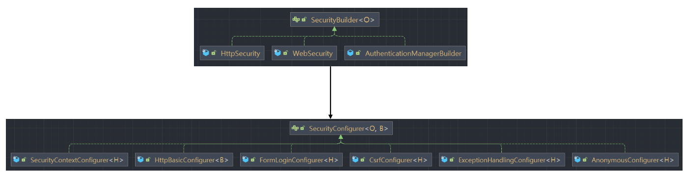

> [스프링 시큐리티 완전 정복 [6.x 개정판] - 정수원](https://www.inflearn.com/course/%EC%8A%A4%ED%94%84%EB%A7%81-%EC%8B%9C%ED%81%90%EB%A6%AC%ED%8B%B0-%EC%99%84%EC%A0%84%EC%A0%95%EB%B3%B5/dashboard) 

# SecurityBuilder / SecurityConfigurer
- SecurityBuilder 는 빌더 클래스로 웹 보안을 구성하는 빈 객체와 설정 클래스 들을 생성하는 역활은한다.   
  WebSecurity, HttpSecurity
- SecurityConfigurer 는 Http 요청과 관련된 보안처리를 담당하는 필터들을 생성하고 여러 초기화 설정에 관여 한다.
- SecurityBuilder 는 SecurityConfigurer 를 참조하고 있으며 인증 및 인가 초기화 작업은 SecurityConfigurer 에 의해 진행 된다.




HttpSecurity.java, SpringBootWebSecurityConfiguration.java, AbstractSecurityBuilder.java 에서 
해당 break point 찍어 확인하면 된다.

# WebSecurity / HttpSecurity
- HttpSecurityConfiguration 에서 HttpSecurity 를 생성하고 초기화를 진행한다
- HttpSecurity 는 보안에 필요한 각 설정클래스와 필터들을 생성하고 최종적으로 SecurityFilterChain 빈생성


## WebSecurity
- WebSecurityConfiguration 에서 WebSecurity 를 생성하고 초기화를 진행한다
- WebSecurity 는 HttpSecurity 에서 생성한 SecurityFilter Chain 빈을 SecurityBuilder 에 저장한다
- WebSecurity 가 build() 를 실행하면 SecurityBuilder 에서 SecurityFilterChain 을 꺼내어   
  FilterChainProxy 생성자에게 전달한다

# DelegatingFilterProxy / FilterChainProxy

## Filter
- 서블릿 필터는 웹 어플리케이션에서 클라이언트의 요청과 서버의 응답을 가공하거나 검사하는데 사용되는 구성 요소
- 서블릿 필터는 클라이언트의 요청이 서블릿에 도달하기 전이나 서블릿이 응답을 클라잉ㄴ트에게 보내기 전에 특정 작업을 수행할 수 있다.

### Filter interface
- init() -> 필터 초기화시 필요한 작업 수행
- doFilter(request, response, chain)
  - 요청 처리 전에 수행할 작업 ServletRequest 수정
  - chain.doFilter(req, res) 다음 필터로 요청과 응답을 전달
  - 응답 처리후 수행할 작업 ServletResponse 수정
- destroy() -> 필터가 제거될때 필요한 정리 작업 수행

## DelegatingFilterProxy class
- 스프링에서 사용되는 특별한 서블릿 필터로, 서블릿 컨테이너와 스프링 어플리케이션 컨텍스트 간의 연결고리 역활 하는 필터
- 서블릿 필터 기능을 수행하는 동시에 스피링의 의존및 빈관리 기능과 연관되도록 설게된 필터
- ```springSecurityFtilerChain``` 이름으로 생성된 빈을 ApplicationContext 에서 찾아 요청을 위임
- 실제 보안처리 X

## FilterChainProxy class
- springSecurityFilterChain 의 이름으로 생성된 필터빈으로 DelegatingFilterProxy 로부터 요청을 위임받아 보안처리 역활
- 내부적으로 하나 이상의 SecurityFilterChain 객체들을 가지고 있다 -> 사용자 요청을 필터 순서대로 호출 -> Custom 가능
- HttpSecurity 를 통해 Api 추가시 관련 필터들이 추가된다